# 🏗️ ML Arsenal - System Architecture & Design

## 📋 Executive Summary

The ML Arsenal is a comprehensive, production-ready machine learning platform designed to be the definitive ML codebase. It follows industry best practices for ML engineering, MLOps, and software architecture to deliver scalable, maintainable, and reliable machine learning solutions.

## 🎯 Architecture Principles

### Core Design Principles
- **Modularity**: Loosely coupled, highly cohesive components
- **Scalability**: Horizontal and vertical scaling capabilities
- **Maintainability**: Clean code, comprehensive documentation
- **Testability**: Extensive test coverage with CI/CD integration
- **Reproducibility**: Deterministic experiments and deployments
- **Extensibility**: Plugin architecture for new algorithms and models

### MLOps Integration
- **Version Control**: Git + DVC for code, data, and model versioning
- **Experimentation**: MLflow + Weights & Biases tracking
- **Deployment**: Docker + Kubernetes for containerized deployments
- **Monitoring**: Real-time model performance and drift detection
- **CI/CD**: Automated testing, validation, and deployment pipelines

## 🏛️ High-Level Architecture

```mermaid
graph TB
    subgraph "🎯 User Interface Layer"
        CLI[Command Line Interface]
        API[REST/GraphQL APIs]
        UI[Web Dashboard]
        NB[Jupyter Notebooks]
    end

    subgraph "🧠 ML Core Engine"
        ALG[Algorithm Library]
        MODEL[Model Registry]
        TRAIN[Training Engine]
        EVAL[Evaluation Framework]
    end

    subgraph "📊 Data Platform"
        INGEST[Data Ingestion]
        PROCESS[Data Processing]
        VALID[Data Validation]
        STORE[Data Storage]
    end

    subgraph "🚀 Deployment Platform"
        SERVE[Model Serving]
        BATCH[Batch Inference]
        STREAM[Stream Processing]
        MONITOR[Monitoring]
    end

    subgraph "⚙️ Infrastructure Layer"
        COMPUTE[Compute Resources]
        STORAGE[Storage Systems]
        NETWORK[Networking]
        SECURITY[Security Layer]
    end

    CLI --> ALG
    API --> MODEL
    UI --> EVAL
    NB --> TRAIN

    ALG --> PROCESS
    MODEL --> VALID
    TRAIN --> STORE
    EVAL --> INGEST

    PROCESS --> SERVE
    VALID --> BATCH
    STORE --> STREAM
    INGEST --> MONITOR

    SERVE --> COMPUTE
    BATCH --> STORAGE
    STREAM --> NETWORK
    MONITOR --> SECURITY
```

## 🗂️ Component Architecture

### 1. Core ML Engine (`src/core/`)
**Purpose**: Foundational ML algorithms and models
- **Algorithm Library**: From-scratch implementations of core ML algorithms
- **Model Registry**: Centralized model management and versioning
- **Training Engine**: Distributed training with advanced optimization
- **Evaluation Framework**: Comprehensive metrics and validation

### 2. Data Platform (`src/data/`)
**Purpose**: End-to-end data lifecycle management
- **Ingestion**: Multi-source data connectors (APIs, databases, files)
- **Processing**: ETL/ELT pipelines with transformation logic
- **Validation**: Data quality checks and schema validation
- **Storage**: Efficient data storage with partitioning and indexing

### 3. Feature Engineering (`src/features/`)
**Purpose**: Advanced feature creation and selection
- **Automated Feature Engineering**: AutoML-style feature generation
- **Feature Selection**: Statistical and ML-based feature selection
- **Feature Store**: Centralized feature management and serving
- **Transformation Pipelines**: Reusable preprocessing components

### 4. Model Development (`src/models/`)
**Purpose**: Model lifecycle management
- **Classical ML**: Traditional algorithms (SVM, Random Forest, etc.)
- **Deep Learning**: Neural networks and modern architectures
- **Generative AI**: LLMs, VAEs, GANs, Diffusion models
- **Ensemble Methods**: Advanced ensemble techniques

### 5. Evaluation & Metrics (`src/evaluation/`)
**Purpose**: Comprehensive model assessment
- **Standard Metrics**: Classification, regression, ranking metrics
- **Custom Metrics**: Domain-specific evaluation functions
- **Visualization**: Performance plots and model interpretation
- **A/B Testing**: Statistical significance testing framework

### 6. Deployment & Serving (`src/deployment/`)
**Purpose**: Production model deployment
- **REST APIs**: FastAPI-based model serving endpoints
- **Batch Processing**: Large-scale batch inference jobs
- **Real-time Serving**: Low-latency online prediction
- **Edge Deployment**: Optimized models for IoT/mobile

### 7. Monitoring & Observability (`src/monitoring/`)
**Purpose**: Production model monitoring
- **Performance Monitoring**: Accuracy, latency, throughput tracking
- **Data Drift Detection**: Statistical drift detection algorithms
- **Model Drift Detection**: Performance degradation alerts
- **Logging & Alerting**: Comprehensive logging and notification system

### 8. MLOps Toolkit (`src/mlops/`)
**Purpose**: ML operations automation
- **Pipeline Orchestration**: Workflow management and scheduling
- **Experiment Tracking**: MLflow and W&B integration
- **Model Registry**: Production model management
- **CI/CD Integration**: Automated testing and deployment

### 9. Utilities & Infrastructure (`src/utils/`)
**Purpose**: Supporting infrastructure and utilities
- **Configuration Management**: YAML/JSON config handling
- **Logging**: Structured logging across components
- **Database Connections**: Multi-database connectivity
- **Cloud Integration**: AWS, GCP, Azure connectors

## 🔄 Data Flow Architecture

### Training Pipeline

### Inference Pipeline

## 🛡️ Security Architecture

### Data Security
- **Encryption**: At-rest and in-transit data encryption
- **Access Control**: Role-based access control (RBAC)
- **Data Privacy**: PII detection and anonymization
- **Compliance**: GDPR, CCPA compliance frameworks

### Model Security
- **Model Signing**: Cryptographic model verification
- **Adversarial Defense**: Robustness against adversarial attacks
- **Audit Logging**: Comprehensive audit trails
- **Secure Deployment**: Container security and network isolation

## 📈 Scalability Architecture

### Horizontal Scaling
- **Microservices**: Service-oriented architecture
- **Load Balancing**: Intelligent request distribution
- **Auto-scaling**: Dynamic resource allocation
- **Distributed Computing**: Spark/Dask integration

### Vertical Scaling
- **GPU Acceleration**: CUDA/ROCm support
- **Memory Optimization**: Efficient memory management
- **CPU Optimization**: Multi-threading and vectorization
- **Storage Optimization**: Efficient data formats (Parquet, Arrow)

## 🔧 Technology Stack

### Core Technologies
- **Languages**: Python 3.9+, SQL, JavaScript/TypeScript
- **ML Frameworks**: scikit-learn, PyTorch, TensorFlow, JAX
- **Data Processing**: Pandas, Polars, Dask, Apache Spark
- **Databases**: PostgreSQL, MongoDB, Redis, ClickHouse

### MLOps Stack
- **Experiment Tracking**: MLflow, Weights & Biases
- **Orchestration**: Apache Airflow, Prefect, Kubeflow
- **Model Serving**: FastAPI, TorchServe, TensorFlow Serving
- **Monitoring**: Prometheus, Grafana, ELK Stack

### Infrastructure
- **Containerization**: Docker, Podman
- **Orchestration**: Kubernetes, Docker Swarm
- **Cloud Platforms**: AWS, GCP, Azure
- **Storage**: S3, GCS, Azure Blob, MinIO

## 🎯 Quality Assurance

### Testing Strategy
- **Unit Tests**: 95%+ code coverage
- **Integration Tests**: End-to-end pipeline testing
- **Performance Tests**: Load and stress testing
- **ML Tests**: Data validation, model performance tests

### Code Quality
- **Linting**: Black, isort, flake8
- **Type Checking**: mypy for static type analysis
- **Documentation**: Sphinx with automatic API docs
- **Security**: Bandit security linting

### Continuous Integration
- **GitHub Actions**: Automated testing and deployment
- **Pre-commit Hooks**: Code quality enforcement
- **Automated Reviews**: CodeQL and dependency scanning
- **Performance Regression**: Automated benchmark comparisons

## 🗺️ Migration Strategy

### Phase 1: Foundation (Weeks 1-2)
- Implement core architecture skeleton
- Set up development environment and tooling
- Create base classes and interfaces
- Establish testing framework

### Phase 2: Core ML Engine (Weeks 3-6)
- Migrate and organize existing ML implementations
- Implement training and evaluation frameworks
- Set up model registry and versioning
- Create comprehensive test suite

### Phase 3: Data Platform (Weeks 7-10)
- Implement data ingestion and processing pipelines
- Set up feature engineering framework
- Create data validation and quality checks
- Integrate with existing datasets

### Phase 4: MLOps Integration (Weeks 11-14)
- Implement monitoring and observability
- Set up CI/CD pipelines
- Create deployment automation
- Integrate experiment tracking

### Phase 5: Production Readiness (Weeks 15-16)
- Performance optimization and profiling
- Security hardening and compliance
- Documentation and user guides
- Production deployment and monitoring

## 📊 Success Metrics

### Technical Metrics
- **Code Quality**: >95% test coverage, <10% technical debt
- **Performance**: <100ms inference latency, >99% uptime
- **Scalability**: Handle 10x traffic increase without degradation
- **Security**: Zero critical vulnerabilities, complete audit compliance

### Business Metrics
- **Developer Productivity**: 50% faster model development cycles
- **Model Performance**: >95% accuracy across benchmark datasets
- **Operational Efficiency**: 80% reduction in manual operations
- **Cost Optimization**: 40% reduction in infrastructure costs

## 🔮 Future Roadmap

### Short-term (3-6 months)
- AutoML integration for automated model selection
- Advanced interpretability and explainability tools
- Federated learning framework implementation
- Edge AI deployment optimization

### Medium-term (6-12 months)
- Quantum machine learning integration
- Advanced neural architecture search
- Multi-modal AI capabilities
- Real-time streaming ML pipelines

### Long-term (12+ months)
- Full autonomous ML operations
- Advanced AI safety and alignment features
- Cross-platform compatibility (mobile, web, embedded)
- Contribution to open-source ML ecosystem

---

This architecture document serves as the blueprint for creating the greatest ML codebase ever, combining cutting-edge research with production-ready engineering practices.
