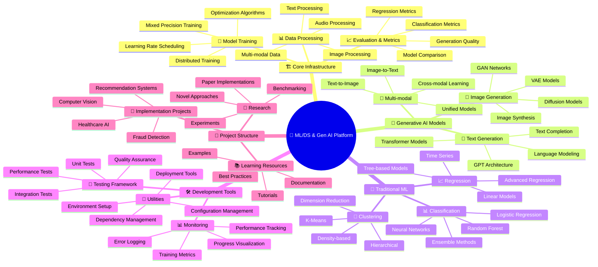
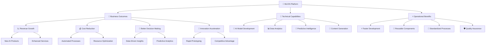
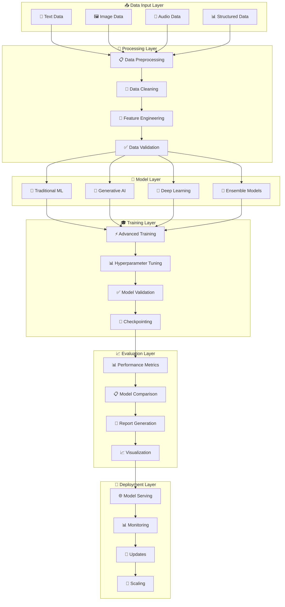
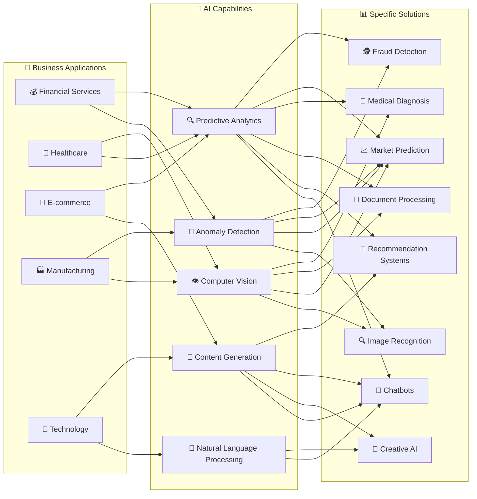

# 🧠 ML/DS Codebase Mind Map and Documentation

## 📋 Overview

This document provides a comprehensive, non-technical overview of the ML/DS and Generative AI codebase structure. It's designed to help stakeholders, project managers, and new team members understand the architecture and capabilities at a high level.

## 🗺️ High-Level Architecture Mind Map



## 🏢 Business Value Perspective



## 🔧 Technical Architecture Flow



## 🎯 Use Case Categories



## 🛠️ Development Workflow

```mermaid
gitgraph
    commit id: "📋 Requirements"
    branch data-preparation
    checkout data-preparation
    commit id: "📊 Data Collection"
    commit id: "🧹 Data Cleaning"
    commit id: "🔧 Feature Engineering"
    
    checkout main
    merge data-preparation
    
    branch model-development
    checkout model-development
    commit id: "🤖 Model Design"
    commit id: "🎓 Training Setup"
    commit id: "⚡ Training Execution"
    
    branch evaluation
    checkout evaluation
    commit id: "📈 Model Evaluation"
    commit id: "📊 Performance Analysis"
    commit id: "📋 Report Generation"
    
    checkout model-development
    merge evaluation
    
    checkout main
    merge model-development
    
    branch deployment
    checkout deployment
    commit id: "🚀 Model Deployment"
    commit id: "📊 Production Monitoring"
    commit id: "🔄 Continuous Improvement"
    
    checkout main
    merge deployment
    commit id: "✅ Production Ready"
```

## 📚 Component Breakdown for Non-Technical Users

### 🎯 **What Each Component Does**

#### 🏗️ **Core Infrastructure**
- **Purpose**: Foundation that makes everything work smoothly
- **What it does**: Handles data, manages training, measures performance
- **Business value**: Ensures reliable, efficient AI development

#### 🤖 **Generative AI Models**
- **Purpose**: Creates new content (text, images, etc.)
- **What it does**: Generates human-like text, creates images, produces multimedia content
- **Business value**: Enables creative applications, content automation, personalized experiences

#### 🧮 **Traditional ML**
- **Purpose**: Makes predictions and finds patterns
- **What it does**: Classifies data, predicts values, groups similar items
- **Business value**: Powers decision-making, automates analysis, identifies opportunities

#### 🛠️ **Development Tools**
- **Purpose**: Ensures quality and accelerates development
- **What it does**: Tests code, monitors performance, manages configurations
- **Business value**: Reduces errors, speeds development, ensures reliability

### 💼 **Business Impact Matrix**

| Component | Time to Market | Cost Efficiency | Innovation Potential | Risk Mitigation |
|-----------|---------------|-----------------|---------------------|-----------------|
| 🏗️ Core Infrastructure | ⭐⭐⭐⭐⭐ | ⭐⭐⭐⭐⭐ | ⭐⭐⭐ | ⭐⭐⭐⭐⭐ |
| 🤖 Generative AI | ⭐⭐⭐ | ⭐⭐⭐ | ⭐⭐⭐⭐⭐ | ⭐⭐⭐ |
| 🧮 Traditional ML | ⭐⭐⭐⭐ | ⭐⭐⭐⭐ | ⭐⭐⭐ | ⭐⭐⭐⭐ |
| 🛠️ Development Tools | ⭐⭐⭐⭐⭐ | ⭐⭐⭐⭐ | ⭐⭐ | ⭐⭐⭐⭐⭐ |

## 🚀 Getting Started Guide for Stakeholders

### 📋 **Phase 1: Understanding (Week 1-2)**
1. Review this documentation
2. Understand business use cases
3. Identify relevant applications
4. Plan initial experiments

### 🧪 **Phase 2: Experimentation (Week 3-6)**
1. Run example projects
2. Test with sample data
3. Evaluate performance
4. Assess feasibility

### 🏗️ **Phase 3: Development (Week 7-12)**
1. Customize for specific needs
2. Train models on real data
3. Integrate with existing systems
4. Test in staging environment

### 🚀 **Phase 4: Deployment (Week 13-16)**
1. Deploy to production
2. Monitor performance
3. Collect feedback
4. Iterate and improve

## 📊 Success Metrics

### 🎯 **Technical Metrics**
- **Model Accuracy**: How correct are the predictions?
- **Processing Speed**: How fast does it work?
- **Resource Usage**: How much computing power needed?
- **Reliability**: How often does it work without issues?

### 💼 **Business Metrics**
- **ROI**: Return on investment from AI implementation
- **Time Savings**: Reduction in manual work
- **Quality Improvement**: Better outcomes and decisions
- **Customer Satisfaction**: Enhanced user experience

## 🔮 Future Roadmap

### 🎯 **Short Term (3-6 months)**
- Enhanced model performance
- More pre-built solutions
- Better integration tools
- Extended documentation

### 🚀 **Medium Term (6-12 months)**
- Multi-modal AI capabilities
- Real-time processing
- Advanced automation
- Cloud deployment options

### 🌟 **Long Term (1-2 years)**
- Fully autonomous AI systems
- Industry-specific solutions
- Advanced reasoning capabilities
- Comprehensive AI platform

---

**This mind map provides a comprehensive, non-technical overview of the ML/DS codebase, enabling stakeholders to understand the platform's capabilities, business value, and implementation pathway without requiring deep technical knowledge.**
